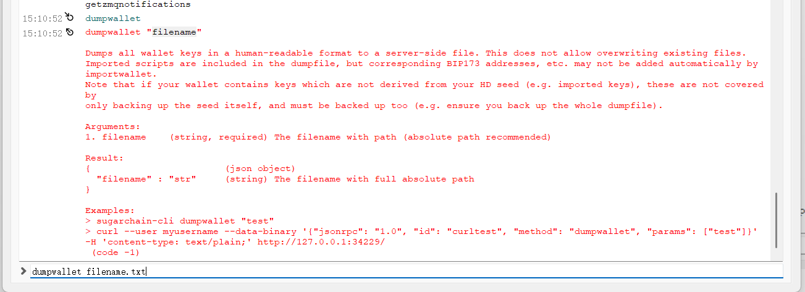

# CheckSugarAddressAmount
Many people save wallet addresses in which Sugar coins cannot be transferred out, this warehouse will provide a solution, providing tools to quickly find the address with the balance, and **cherish every sugarcoin**.

You can tip me if it helps. Here's my wallet address↓

sugar1qnayg20edjqshzd9cuzungycygejdujqacpx9y0

* The first is the full node wallet export private key tutorial
  1. Export all the private keys of the wallet

2. Run the script file above, check the balance of the wallet, and the address with the balance will be placed in the output.txt file.
   

3. Find the corresponding private key based on the address in the output.txt file. Then go to Web Wallet to open the wallet and transfer to your new wallet.

   

   

   

* **It is very important to backup your new wallet ！！！！**
